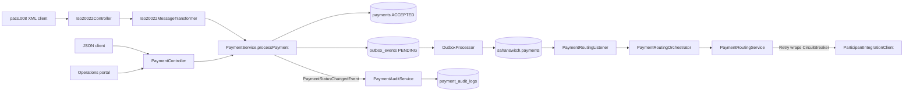
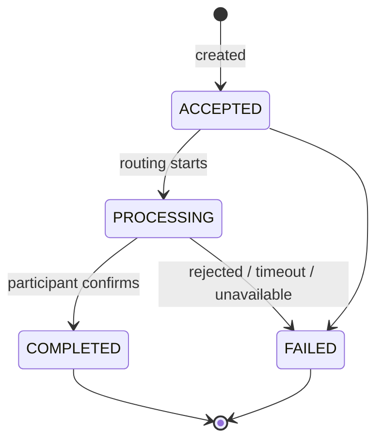

# Sahan Switch: System Overview (End to End)

> **Audience:** an engineer or AI assistant taking over or extending this project.
> **Status date:** 2026-10-05 (updated after security, outbox, analytics and the operations portal).
> Everything described here exists in the repository. Gaps are listed in [section 13](#13-known-limitations-and-risks).

---

## 1. What this system is

**Sahan Switch** is a backend **payment switch**: a central hub that lets financial institutions
(banks, mobile-money wallets, government bodies) send money to each other through one integration
point instead of building a connection to every other institution. It is inspired by the Somali
national payment switch model.

A switch does four jobs, and this project implements all four at prototype level:

1. **Registry**: who is connected (participants).
2. **Accept and protect**: take a payment instruction exactly once, even if the client retries.
3. **Route**: forward the instruction to the destination participant and record the outcome.
4. **Prove**: keep an immutable audit trail and speak the international message standard (ISO 20022).

The participants are currently **simulated by a mock connector**. No real bank is called yet.

### Technology

| Concern | Choice |
|---|---|
| Language / runtime | Java 21 |
| Framework | Spring Boot 4.1.0 (Spring Framework 7, Hibernate 7, Jackson 3) |
| Web | Spring MVC (`spring-boot-starter-webmvc`) |
| Persistence | Spring Data JPA + PostgreSQL 16 |
| Schema management | Flyway (migrations V1 to V10), Hibernate `ddl-auto=validate` |
| Security | Spring Security: JWT (HS256) for people, SHA-256 API keys (`X-API-KEY`) for participants |
| Messaging | RabbitMQ (Spring AMQP) + transactional outbox |
| Validation | Jakarta Bean Validation |
| API docs | springdoc-openapi (Swagger UI, Bearer + API-key schemes) |
| Fault tolerance | Resilience4j core (`retry`, `circuitbreaker`), not the Spring starter |
| ISO 20022 | Hand-written JAXB model (Jakarta XML Binding + Glassfish runtime) |
| Operations portal | Vite, React 18, TypeScript, Tailwind, TanStack Query (`frontend/sahan-switch-portal`) |
| Tests | JUnit 5, Mockito, MockMvc, Testcontainers 2.x (optional external DB + local RabbitMQ) |
| Port / profile | backend `9090` / `dev`; portal `5173` |

---

## 2. Architecture

A **modular monolith**: one deployable application, split into modules with clear boundaries.
Each module uses the same four layers.

```
api             HTTP controllers and request/response DTOs
application     use-case services (business flow, transactions)
domain          entities, enums, domain events, domain exceptions (business rules live here)
infrastructure  repositories, external clients, configuration
```

```
com.sahanswitch
├── security        JWT login, API-key filter, users, authorization
├── participant     registry of institutions (+ API-key lifecycle)
├── payment         payment aggregate, state machine, search, sync/async initiation
├── integration     routing to participants + retry + circuit breaker + mock connector
├── iso20022        pacs.008 / pacs.002 generate and parse
├── audit           immutable status-change history
├── outbox          transactional outbox relay to RabbitMQ
├── messaging       exchanges, queues, DLQ, routing listener
├── analytics       operational summary for the dashboard
└── common          error model, exception handler, correlation-id filter, config
```

### Request flow (async routing, the default)



Set `sahanswitch.routing.mode=sync` to keep routing inside the HTTP request (no broker needed; used by most existing tests).

### Cross-cutting behaviour

- **Authentication.** Every endpoint except login, health and Swagger requires a JWT
  (`Authorization: Bearer`) or a participant API key (`X-API-KEY`). 401/403 use the same `ApiError` JSON.
- **Correlation ID.** `CorrelationIdFilter` reads `X-Correlation-Id` (or generates a UUID), puts it in
  the SLF4J MDC, echoes it on the response, and the log pattern prints it as `[corr=...]`. The same id is
  stored in every audit row, so one request can be followed across logs and the database.
- **Uniform errors.** Every error is an `ApiError` JSON body (see [section 8](#8-error-model)).
- **Optimistic locking.** `Payment` has a `@Version` column, so concurrent updates cannot silently overwrite each other.
- **Timestamps.** `created_at` / `updated_at` are filled by JPA auditing.

---

## 3. Domain model

### Participant (`participants`)

| Field | Notes |
|---|---|
| `id` | UUID |
| `code` | unique, up to 50 chars. Also the identifier used in ISO 20022 messages (`MmbId`) |
| `name` | up to 150 chars |
| `type` | `BANK`, `MOBILE_WALLET`, `GOVERNMENT`, `OTHER` |
| `status` | `ACTIVE`, `INACTIVE`. `isActive()` is purely `status == ACTIVE` |
| `api_key_hash` | SHA-256 of `ssk_<random>`; unique when present. Clear text is shown once. |
| `allowed_roles` | default `PARTICIPANT` |
| `created_at`, `updated_at` | audited |

Only `ACTIVE` participants may send or receive payments.

### Payment (`payments`)

| Field | Notes |
|---|---|
| `id`, `payment_reference` | UUID, and a human reference like `SHN-E43034CA0CA1` |
| `idempotency_key` | unique **per sender participant** |
| `participant_id` | the **sender** |
| `destination_participant_id` | the receiver (nullable only for rows created before V6) |
| `source_account`, `destination_account`, `amount` (`NUMERIC(19,4)`), `currency` | |
| `status` | `ACCEPTED`, `PROCESSING`, `COMPLETED`, `FAILED`, `PENDING` |
| `external_reference` | the participant's own reference on success |
| `failure_reason` | `TEXT`, capped at 4000 characters in code |
| `end_to_end_id` (35), `uetr` (UUIDv4), `debtor_name`, `creditor_name` (140) | ISO 20022 identifiers, optional on input |
| `version` | optimistic lock |

When not supplied, `uetr` is generated (UUIDv4) and `end_to_end_id` defaults to the payment reference.

### Payment state machine



Invalid transitions raise `InvalidPaymentStateException` (HTTP 409). `PENDING` exists as an enum value
and is mapped in pacs.002 but is not produced by the current flow.

### Audit log (`payment_audit_logs`)

`id, payment_id (FK), previous_status, new_status, reason, correlation_id, created_at`.
**Append-only at the database level**: a trigger (`trg_payment_audit_logs_immutable`) raises an error on any
`UPDATE` or `DELETE`. Consequence: audited payments cannot be deleted either (foreign key), so test data
cannot be cleaned up from a live database. Use a scratch database for experiments.

### Users (`users`)

Portal operators. `username` unique, `password_hash` (BCrypt), `role` `ADMIN` or `PARTICIPANT`,
optional `participant_id`. The first `ADMIN` is created at startup by `AdminBootstrap`
(`SAHANSWITCH_ADMIN_USERNAME` / `SAHANSWITCH_ADMIN_PASSWORD`). In the `dev` profile the documented
default is `admin` / `ChangeMe!123`; otherwise a random password is generated and logged once.

### Outbox (`outbox_events`)

`id, aggregate_type, aggregate_id, type, payload (JSONB), status (PENDING|PUBLISHED|FAILED),
created_at, published_at, attempts, last_error`. Written in the same transaction as the payment
change. A scheduled relay publishes PENDING rows to RabbitMQ with publisher confirms.

---

## 4. Core business flow: `PaymentService.processPayment`

1. **Validate participants.** Sender and destination must exist (404), be active (422), and differ (400).
2. **Idempotency lookup** by (sender, `Idempotency-Key`).
   - Found and the request matches, so it is a **replay**: return the stored payment with **HTTP 200**. Nothing is re-sent.
   - Found but the request differs (destination, accounts, amount, currency, or UETR/EndToEndId if supplied), so **HTTP 409**.
3. **Create** the payment as `ACCEPTED` and flush. Publish the creation event (`null -> ACCEPTED`).
4. **Routing mode:**
   - **`async` (default):** append a `PaymentRoutingRequested` outbox row and return **201** with status `ACCEPTED`.
     The ISO endpoint answers pacs.002 `ACCP`. A RabbitMQ consumer later runs `PaymentRoutingOrchestrator`
     (ACCEPTED → PROCESSING outside a long DB transaction → COMPLETED or FAILED). Clients poll `GET /payments/{id}`.
   - **`sync`:** move to `PROCESSING`, route immediately, apply the result, return the final status (today's original behaviour).

**Authorization.** A participant identity may only initiate when `senderParticipantId` equals its own id (403).
Reads, audit and pacs XML are limited to payments where it is sender or destination (otherwise 404).
Administrators are unrestricted. Participant management, analytics and the manual lifecycle endpoints are `ADMIN` only.

**Race safety.** If two identical requests arrive at once, both pass the lookup and one insert hits the unique
constraint. `processPayment` is deliberately *not* transactional; it uses a `TransactionTemplate`. On
`DataIntegrityViolationException` it re-reads in a fresh transaction and treats the request as a replay.
Verified with an 8-thread test: exactly one payment is created, seven callers get the same payment back.

**Transactions and events.** The audit row is written by a `@TransactionalEventListener(phase = BEFORE_COMMIT)`,
i.e. **inside the same database transaction** as the status change. A payment change and its audit record either
both commit or both roll back. `PaymentService` refuses to publish events outside an active transaction.

---

## 5. REST API

Base URL (dev): `http://localhost:9090`. Interactive docs: `/swagger-ui/index.html`, spec: `/v3/api-docs`.
All JSON unless noted. `X-Correlation-Id` is optional on every request.
**Authenticated by default.** Send `Authorization: Bearer <jwt>` or `X-API-KEY: ssk_...`.

### Auth

| Method | Path | Success | Errors |
|---|---|---|---|
| `POST` | `/api/v1/auth/login` (public) | 200 `{accessToken, tokenType, expiresIn, username, role, participantId}` | 400, 401 |

### Participants

| Method | Path | Who | Success | Errors |
|---|---|---|---|---|
| `GET` | `/api/v1/participants` | any identity | 200 list | 401 |
| `GET` | `/api/v1/participants/{id}` | any identity | 200 | 404 |
| `POST` | `/api/v1/participants` | ADMIN | 201, includes `apiKey` once | 400, 409 |
| `POST` | `/api/v1/participants/{id}/api-key` | ADMIN | 200, new `apiKey` once | 404 |
| `PATCH` | `/api/v1/participants/{id}/deactivate` | ADMIN | 200 | 404 |

```json
POST /api/v1/participants
{ "code": "EVC", "name": "EVC-PLUS", "type": "MOBILE_WALLET" }
```

### Payments

| Method | Path | Who | Success | Errors |
|---|---|---|---|---|
| `POST` | `/api/v1/payments` (`Idempotency-Key` required) | sender = self, or ADMIN | **201** created, **200** replay | 400, 403, 404, 409, 422 |
| `GET` | `/api/v1/payments/search` | scoped to own payments | 200 `Page` DTO | 400 (bad sort/date) |
| `GET` | `/api/v1/payments/{paymentId}` | party or ADMIN | 200 | 404 |
| `GET` | `/api/v1/payments/by-reference/{paymentReference}` | party or ADMIN | 200 | 404 |
| `GET` | `/api/v1/payments/{paymentId}/audit` | party or ADMIN | 200 | 404 |
| `POST` | `/api/v1/payments/{paymentId}/processing` | ADMIN | 200 | 409 |
| `POST` | `/api/v1/payments/{paymentId}/complete` | ADMIN | 200 | 409 |
| `POST` | `/api/v1/payments/{paymentId}/fail` | ADMIN | 200 | 409 |

`GET /search` filters: `senderParticipantId`, `destinationParticipantId`, `status`, `currency`, `reference` (contains),
`fromDate` / `toDate` (`yyyy-MM-dd` or ISO instant). Paging: `page`, `size` (max 100), `sort` (whitelist:
`createdAt`, `updatedAt`, `amount`, `currency`, `status`, `paymentReference`).

The last three are manual lifecycle operations kept for backward compatibility. They take no body or parameters
(the audit reasons are fixed texts: "Processing started manually", "Completed manually", and so on), and each one
is audited. In the normal flow the switch drives these transitions itself.

```json
POST /api/v1/payments        Idempotency-Key: 8f2c-...
{
  "senderParticipantId": "<uuid>",
  "destinationParticipantId": "<uuid>",
  "sourceAccount": "615507298",
  "destinationAccount": "628139911",
  "amount": 12.50,
  "currency": "USD",
  "endToEndId": "optional, max 35",
  "uetr": "optional UUIDv4",
  "debtorName": "optional, max 140",
  "creditorName": "optional, max 140"
}
```

### ISO 20022

| Method | Path | Success | Errors |
|---|---|---|---|
| `POST` | `/api/v1/iso20022/pacs008` (XML in, **pacs.002 XML out**) | 201 created, 200 replay | 400 (`fieldErrors` keyed by ISO path), 409 |
| `GET` | `/api/v1/payments/{paymentId}/pacs008` | 200 XML | 404 |
| `GET` | `/api/v1/payments/{paymentId}/pacs002` | 200 XML status report | 404 |

- `Idempotency-Key` is optional on the pacs.008 endpoint; the **UETR** is used when it is absent.
- Participants are identified by `FinInstnId/ClrSysMmbId/MmbId`, which holds the participant `code`.
- pacs.002 status mapping: `ACCEPTED`→`ACCP`, `PROCESSING`→`ACSP`, `COMPLETED`→`ACSC`, `FAILED`→`RJCT`, `PENDING`→`PDNG`.
  Rejection reason codes: `AB05` for timeouts, `NARR` otherwise (free text in `AddtlInf`, max 105 chars).
- The parser is **XXE-hardened**: DOCTYPE rejected, DTDs and external entities disabled, 1 MB size cap.
- Validation covers EndToEndId, UETR (UUIDv4), amount (positive, scale at most 4) and currency, debtor and creditor names, both accounts, both agents, and that agents resolve to known participants. All violations are returned at once.
- In **async** mode a newly created payment's pacs.002 is `ACCP` (accepted by the switch, not yet settled). Poll `/pacs002` for `ACSC` / `RJCT`.

### Analytics (ADMIN)

| Method | Path | Success |
|---|---|---|
| `GET` | `/api/v1/analytics/summary?hours=24` | Totals, volume/value by currency and status, success/failure per destination participant, hourly series, active participant count, circuit-breaker state |

### Platform

`GET /actuator/health` is public. `GET /actuator/info` is ADMIN. `GET /v3/api-docs` and `/swagger-ui/index.html` stay public so operators can read the spec; calling APIs from Swagger still needs Authorize.

---

## 6. Routing, resilience and the mock connector

`PaymentRoutingService.routeTo(code, payment)` resolves the destination participant's integration client and calls it
through two Resilience4j layers (**Retry wraps CircuitBreaker**, one breaker per participant code):

| Setting (`sahanswitch.resilience.*`) | Default |
|---|---|
| `retry.max-attempts` | 3 (first try plus 2 retries) |
| `retry.initial-backoff` / `backoff-multiplier` | 200 ms / 2.0 (waits 200 ms, then 400 ms) |
| `circuit-breaker.sliding-window-size` / `minimum-number-of-calls` | 10 / 5 |
| `circuit-breaker.failure-rate-threshold` | 50 % |
| `circuit-breaker.wait-duration-in-open-state` | 30 s |
| `circuit-breaker.permitted-calls-in-half-open` | 3 |

- A **business rejection** (`FAILED` from the participant) is *not* retried and does *not* count against the breaker.
  Only **timeouts / unavailability** do.
- When retries are exhausted or the breaker is open, a **fallback** returns `IntegrationResult.timeout(...)` and the payment
  ends `FAILED` with a message such as `Participant timeout: Participant DBI unavailable after 3 attempt(s)...`.
- Breakers are **per participant**, so one failing institution does not affect the others.

**Mock connector** (`MockParticipantIntegrationClient`, clearly mock-only). The destination *account number* selects the outcome:

| Destination account | Result |
|---|---|
| starts with `FAIL-` | `FAILED` ("account cannot receive funds") |
| starts with `TIMEOUT-` | `TIMEOUT` (triggers retry and circuit breaker) |
| anything else | `SUCCESS` with a generated external reference |

`IntegrationResult` is a record `(status, externalReference, failureReason, message)` with factories `success`, `failed`, `timeout`.
Replacing the mock with real connectors means implementing `ParticipantIntegrationClient` per institution.

---

## 7. Database

Flyway migrations (Hibernate only *validates*; it never changes the schema):

| Version | Purpose |
|---|---|
| V1 | initial schema (`system_metadata`) |
| V2 | `participants` |
| V3 | `payments` |
| V4 | payment `version` (optimistic locking) |
| V5 | processing fields (`external_reference`, `failure_reason`) |
| V6 | destination participant on payments |
| V7 | `payment_audit_logs` + immutability trigger |
| V8 | `failure_reason` to `TEXT`; indexes; ISO columns (`end_to_end_id`, `uetr`, `debtor_name`, `creditor_name`); unique partial index on `uetr` |
| V9 | `participants.api_key_hash`, `allowed_roles`; `users` table |
| V10 | `outbox_events` + pending/aggregate indexes |

Rules: never edit an applied migration; add a new one.

Connection (dev): `jdbc:postgresql://localhost:5432/sahan_switch`, overridable with
`SPRING_DATASOURCE_URL`, `SPRING_DATASOURCE_USERNAME`, `SPRING_DATASOURCE_PASSWORD`.
The local fallback password is still `123` in `application-dev.yml` so a fresh checkout starts;
production must set the environment variables. JWT secret: `SAHANSWITCH_JWT_SECRET` (min 32 bytes).

### Snapshot of the data currently saved in the dev database (2026-10-05)

| Table | Rows | Content |
|---|---|---|
| `participants` | 5 | EVC (EVC-PLUS, wallet), WAAFI (wallet), E-DAHAB (wallet), DBI (Dahabshiil Bank International, bank), SSB (Salaam Somali Bank, bank), all `ACTIVE` |
| `payments` | 2 | both `EVC -> E-DAHAB`, USD, `COMPLETED` (5.00 and 30.00) |
| `payment_audit_logs` | 3 | all for the second payment: `null->ACCEPTED`, `ACCEPTED->PROCESSING`, `PROCESSING->COMPLETED`, one shared correlation id |
| `system_metadata` | 0 | unused placeholder from V1 |
| `flyway_schema_history` | 8 | V1 to V8, all successful |

The first payment predates the audit table (V7), so it has no audit rows; that is expected, not a defect.
The second payment shows `end_to_end_id = "string"` and the Swagger sample UETR, i.e. it was created from Swagger with default example values.

---

## 8. Error model

Every error body has the same shape (`fieldErrors` appears only for validation problems):

```json
{
  "timestamp": "2026-10-05T08:00:00Z",
  "status": 400,
  "error": "Validation Failed",
  "message": "Request validation failed",
  "fieldErrors": { "amount": "Amount must be greater than zero" }
}
```

| HTTP | Meaning | Examples |
|---|---|---|
| 400 | malformed or invalid input | validation, missing `Idempotency-Key`, malformed JSON / unknown enum, invalid ISO message, sender equals destination |
| 401 | not authenticated | missing/invalid JWT or API key, bad login |
| 403 | authenticated but forbidden | participant initiating as someone else; non-admin hitting admin routes |
| 404 | not found | unknown participant or payment; also used when a participant probes a payment it is not a party to |
| 409 | conflict with current state | duplicate participant code, idempotency key reused with a different request, invalid payment transition, optimistic-lock failure (retry), constraint violation |
| 422 | valid request, business rule refuses | sender or destination participant inactive |

Errors are always returned as `application/json`, even if the client sends `Accept: application/xml`
(see [section 12](#12-verification-evidence) for the bug this fixed).

---

## 9. Project layout and how to run

```
sahan-witch/
├── README.md
├── docs/SYSTEM_OVERVIEW.md                  <- this file
├── frontend/sahan-switch-portal/            Vite React operations portal
└── backend/sahan-switch-backend/
    ├── pom.xml
    └── src/
        ├── main/java/com/sahanswitch/...    modules described in section 2
        ├── main/resources/
        │   ├── application.yml              port, logging, resilience, routing, outbox, JWT
        │   ├── application-dev.yml          datasource env fallbacks, springdoc, admin default
        │   └── db/migration/V1..V10
        └── test/java/...                    unit and integration tests
```

```bash
# prerequisites: JDK 21, PostgreSQL 16, RabbitMQ on localhost:5672 (for async mode)
cd backend/sahan-switch-backend
./mvnw spring-boot:run               # starts on :9090, Flyway migrates automatically

cd frontend/sahan-switch-portal
npm ci && npm run dev                # http://localhost:5173, proxies /api to :9090
```

Sign in to the portal as `admin` / `ChangeMe!123` (dev default). Existing participants need an
API key before they can call the API: `POST /api/v1/participants/{id}/api-key` as admin.

To run the database-backed tests without Docker, point them at any PostgreSQL:

```bash
TEST_DB_URL=jdbc:postgresql://localhost:5432/some_scratch_db \
TEST_DB_USER=postgres TEST_DB_PASSWORD=... \
./mvnw test
```

With Docker available and no `TEST_DB_URL`, the tests start a `postgres:16-alpine` Testcontainer instead.
Do not point `TEST_DB_URL` at the dev database: the tests create data and audit rows are permanent.
Async integration tests talk to RabbitMQ on localhost with a unique queue prefix and delete their queues afterwards.

---

## 10. Testing

| Area | What is covered |
|---|---|
| `PaymentTest` | state machine, ISO defaults, truncation |
| `PaymentServiceTest` | routing outcomes, events, idempotency, race recovery, **async branch** (outbox row, status stays ACCEPTED) |
| `PaymentRoutingOrchestratorTest` / `PaymentRoutingListenerTest` | idempotent redelivery, ignore non-ACCEPTED |
| `OutboxProcessorTest` | publish, failure, max attempts |
| `PaymentAccessPolicyTest`, `ApiKeyServiceTest`, `ApiKeyAuthenticationFilterTest` | ownership, hashing, header filter |
| `PaymentSearchServiceTest`, `PaymentSpecificationsTest`, `AnalyticsServiceTest` | paging, sort whitelist, aggregation |
| `PaymentFlowIntegrationTest` | full stack, **admin JWT**, `routing.mode=sync`, outbox off |
| `SecurityIntegrationTest` | login, 401, participant cannot initiate/read as another (403/404), API keys |
| `AsyncPaymentFlowIntegrationTest` | POST returns ACCEPTED, then COMPLETED via real RabbitMQ; FAIL- / TIMEOUT- async |
| `PaymentSearchAnalyticsIntegrationTest` | search filters + analytics against real data |
| `SahanSwitchBackendApplicationTests` | context starts on default async config, V1–V10 validate |
| `PaymentRoutingServiceTest` | 3 attempts, circuit opens, fallback, per-participant independence (real Resilience4j objects) |
| `Iso20022MessageTransformerTest`, `Iso20022GenerationTest` | every missing-field rejection, UETR format, unknown agents, generate then parse round trip, pacs.002 mapping, XXE and size limits, clean default namespace |
| `PaymentAuditServiceTest` | audit write, listener phase is `BEFORE_COMMIT` |
| `GlobalExceptionHandlerTest` | status and body for every exception type, XML `Accept` regression, malformed body |
| `PaymentFlowIntegrationTest` | full stack on real PostgreSQL: ISO flow with audit trail, idempotent replay, 8-thread race, `FAIL-` and `TIMEOUT-` paths with circuit opening, validation errors, 422, correlation id, database-level audit immutability |
| `SahanSwitchBackendApplicationTests` | application context starts, migrations validate |

---

## 11. Design decisions worth knowing

- **JWT for people, API keys for systems.** Keys are `ssk_` + high-entropy random, stored as SHA-256 (lookup by equality). Rotation invalidates the previous key immediately.
- **Async by default, sync still available.** The HTTP thread never waits on a participant in production config. Sync mode exists so the original 119 tests remain meaningful without a broker.
- **Outbox + publisher confirms.** A payment and its routing request commit together; the relay waits for the broker ack. Delivery is at-least-once; the orchestrator is idempotent.
- **Idempotency scope is (sender, key)**, so two institutions can reuse the same key string.
- **Replay returns 200, creation 201**, so clients can tell them apart without parsing the body.
- **Audit is synchronous and transactional** (chosen over async events) so that history can never disagree with state.
- **Resilience4j core instead of the Spring starter**, which avoids Spring Boot 4 compatibility risk. The beans are explicit in `ResilienceConfig`.
- **Hand-written ISO 20022 subset** instead of generated classes, because the official XSDs are not in the repository.
- **Uniform error contract** with machine-readable `fieldErrors` so front ends can bind errors to form fields.

---

## 12. Verification evidence

Performed on 2026-10-05 (security / outbox / analytics / portal pass).

1. **Build.** `./mvnw clean test-compile` succeeds. Portal: `npm run lint` (0 errors) and `npm run build` succeed.
2. **Unit tests.** All pass with no database (DB-backed tests skip when `TEST_DB_URL` is unset).
3. **Full suite against a throwaway PostgreSQL 16 + local RabbitMQ.** 214 tests, 0 failures, 0 skipped, including `SecurityIntegrationTest`, `PaymentFlowIntegrationTest` (sync), `AsyncPaymentFlowIntegrationTest` (real broker, unique queue prefix), `PaymentSearchAnalyticsIntegrationTest`, and `contextLoads` (Flyway V1–V10 + Hibernate validate).
4. **Upgrade path.** A database stopped at V8 took V9 and V10 cleanly; the application then started with `ddl-auto=validate`.
5. **Curl flow on a clone of the live database** (live data was not written to). Login, 401 without credentials, API-key payment returns `ACCEPTED` then settles to `COMPLETED` with three audit rows, cross-participant 403/404, analytics and search as admin.
6. **Portal smoke.** Sign in at `http://localhost:5173`, dashboard shows live volume/value/success rate/circuit breakers, transactions page loads filters and the participant list. Register/deactivate were not exercised in the browser (they write to the live database).

**Not proven:** Testcontainers on Docker (the user is not in the docker group); Kafka (not used); official ISO XSD validation.

---

## 13. Known limitations and risks

| Area | Limitation |
|---|---|
| Secrets | Dev fallbacks for DB password, JWT secret and admin password still exist in `application-dev.yml`. Production must override via environment variables; do not ship the fallbacks. |
| Participants | The connector is a mock. No real participant integration, no webhooks or callbacks, no settlement or liquidity checks. |
| Payments | A payment stuck in `PROCESSING` after a crash between orchestrator phases 1 and 3 is retried by redelivery (routes again). There is still no dedicated reconciliation job. Only one currency per transfer, no FX, fees or limits. `PENDING` is unused. |
| ISO 20022 | Subset of pacs.008.001.10 / pacs.002.001.10. **Not validated against the official XSD.** Other messages (pacs.004 returns, camt, pain) are not implemented. |
| Operations | Health shows details publicly. No distributed tracing backend. |
| Testing | The Testcontainers path was written but not executed (Docker exists but the user is not in the docker group). Kafka was not used (RabbitMQ is the broker). |

## 14. Suggested next steps (in priority order)

1. **Production secrets and a `prod` profile** (no fallback passwords, JWT secret from a vault, RabbitMQ credentials).
2. **Real connector** for one institution behind `ParticipantIntegrationClient` (HTTP client with timeouts, mutual TLS).
3. **Reconciliation job** for payments left in `PROCESSING` / outbox rows marked `FAILED`.
4. **Validate ISO messages against official XSDs** and add pacs.004 (return) and a status-request message.
5. **Observability**: Micrometer metrics (payments by status, latency, breaker state), structured JSON logs, tracing.
6. **CI pipeline** running the full suite against PostgreSQL and RabbitMQ (Testcontainers on a Docker-enabled runner).
